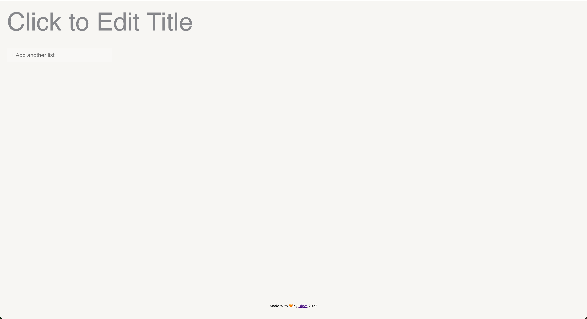

# Aufgabenliste

To do or not...to do. A simple To do app with drag and drop, reordering capabilities.
Live at https://aufgabenlist.netlify.app

### Tech Stack

* Typescript
* React
* ContextAPI
* Docker
* Github Actions for CI/CD

### To Run
First build the docker image, in the terminal in the current directory run `docker build -t aufgabenliste .`

After the image has been built simply start the container `docker run -dp 3002:3000 aufgabenliste`, in your browser make your way to localhost:3002 once the container is up and running. Feel free to change 3002 to whatever port you desire.
